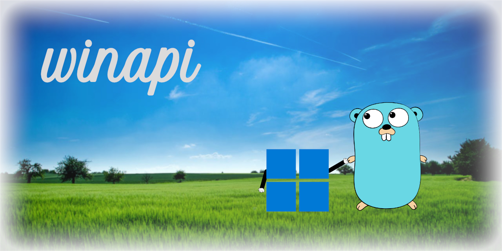

<div align="center">

<h1>winapi</h1>



[](https://spdx.org/licenses/MIT.html)

</div>

## Overview

`winapi` is a [Go](https://go.dev) library that implements [Win32 API](https://learn.microsoft.com/en-us/windows/win32/apiindex/windows-api-list) functions, types, and constants that have not yet been implemented in the well-known [syscall](https://pkg.go.dev/syscall) or [sys.windows](https://pkg.go.dev/golang.org/x/sys/windows) packages.

**License**: [MIT](LICENSE)

## Usage

### Getting Started

From your shell:

```text
go get "github.com/kamaranl/winapi"
```

In your code:

```go
//go:build windows

package mywindowsapp

import "github.com/kamaranl/winapi"

```

## Remarks

* To be used in packages and commands for **Windows only** *(obviously)*

## TODO

* Add more tests
* Add detailed examples

## Acknowledgements

* The original background used in the project [banner](/docs/banner.jpg) was taken by [Ákos Szabó](https://www.pexels.com/@akos-szabo-145938).
